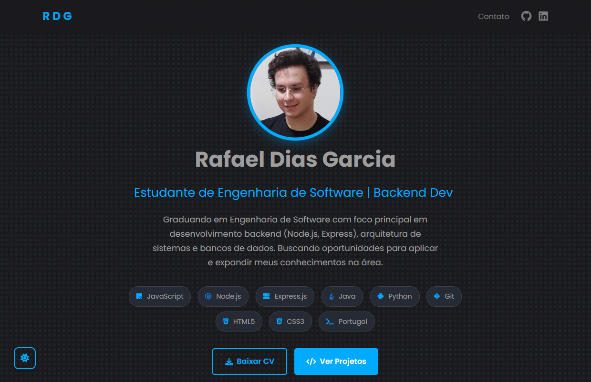

# Rafael Dias Garcia - Curriculum Vitae



**🔗 [Acesse o Portfólio Online](https://rafaeldiasgarcia.github.io/curriculo/)**

---

## 👨‍💻 Sobre Mim

**Desenvolvedor Full-Stack** | JavaScript, PHP e Python

Estudante de **Engenharia de Software** com sólida formação em fundamentos de programação e experiência prática no desenvolvimento de aplicações web completas. 

**📍 Status:** Aberto para Estágios

### 🎯 Objetivos Profissionais

Busco uma oportunidade de estágio em Engenharia de Software para aplicar meus conhecimentos em desenvolvimento web e expandir minha experiência profissional. Tenho interesse em desenvolvimento backend (Java, JavaScript, PHP, Flask), frontend (HTML, CSS, JavaScript, Bootstrap) e bancos de dados relacionais. Ofereço base sólida em algoritmos e estruturas de dados, aliada a uma postura proativa e colaborativa para contribuir com os objetivos da equipe.

---

## 💻 Habilidades Técnicas

### Backend & Bancos de Dados


### Frontend & Ferramentas


### Acadêmico & Outros


🎸 Violão Clássico


## 🌐 Informações Técnicas do Portfólio

### ✨ Funcionalidades do Site

*   **Design Responsivo:** Layout adaptável para desktops, tablets e dispositivos móveis
*   **Tema Dark/Light:** Alternância entre modo escuro (padrão) e modo claro, com preferência salva no `localStorage`
*   **Efeito de Digitação:** Animação no subtítulo da seção principal (Hero)
*   **Animações de Scroll:** Seções aparecem suavemente conforme o usuário rola a página (usando `IntersectionObserver`)
*   **Barra de Progresso de Scroll:** Indicador visual no topo da página
*   **Navegação:** Navbar fixa com links para seções e página de contato
*   **Botões Flutuantes:** Botão "Voltar ao Topo" e botão para alternar o tema
*   **Página de Contato:** Formulário funcional integrado com [Formspree](https://formspree.io/)

### 🛠️ Tecnologias Utilizadas no Portfólio

*   HTML5 (Estrutura semântica)
*   CSS3 (Variáveis CSS, Flexbox, Grid Layout, Animações, Responsividade)
*   Vanilla JavaScript (DOM, Event Listeners, `localStorage`, `IntersectionObserver`, `Fetch API`)
*   Bootstrap 5
*   Font Awesome (Ícones)
*   Google Fonts (Poppins)
*   Formspree (Formulário Backend)

### ⚙️ Como Executar Localmente

1.  Clone este repositório:
    ```bash
    git clone https://github.com/rafaeldiasgarcia/curriculo.git
    ```
2.  Navegue até a pasta do projeto:
    ```bash
    cd curriculo
    ```
3.  Abra o arquivo `index.html` diretamente no seu navegador.

    *Observação:* Como é um site estático, a maioria das funcionalidades rodará diretamente do arquivo. Para uma melhor experiência, use a extensão "Live Server" do VS Code.

---

## 📝 Termos de Uso e Autoria

**Copyright (c) 2025 Rafael Dias Garcia**

Este projeto foi desenvolvido inteiramente por mim, **Rafael Dias Garcia**.

Você tem a permissão para:

*   Visualizar o código-fonte
*   Copiar e modificar o código para **uso pessoal ou educacional**
*   Distribuir cópias ou trabalhos derivados, **desde que seja de forma gratuita e sem fins lucrativos**

**Restrições:**

*   **É estritamente proibido usar este projeto, ou qualquer parte dele, para fins comerciais ou em qualquer aplicação/serviço que gere lucro direto ou indireto**
*   Ao utilizar ou distribuir, por favor, mantenha uma referência à autoria original (meu nome e, se possível, um link para o repositório)

Este projeto é fornecido "como está", sem garantias de qualquer tipo. O uso é por sua conta e risco.

---

## 📫 Contato

*   **Nome:** Rafael Dias Garcia
*   **Email:** rafdgar@gmail.com
*   **Portfólio:** https://rafaeldiasgarcia.github.io/curriculo/
*   **LinkedIn:** https://www.linkedin.com/in/rafaeldiasgarcia
*   **GitHub:** https://github.com/rafaeldiasgarcia

---

*Feito com ❤️ e </> por Rafael Dias Garcia*

